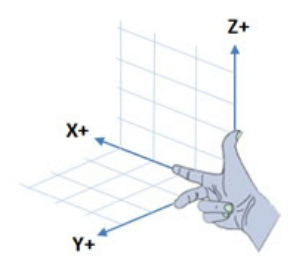
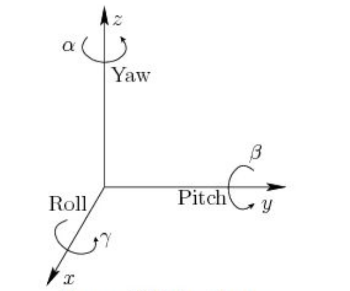
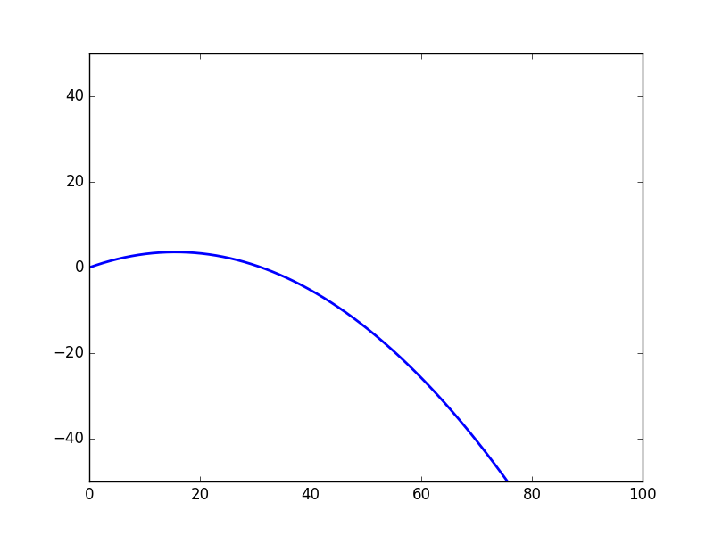
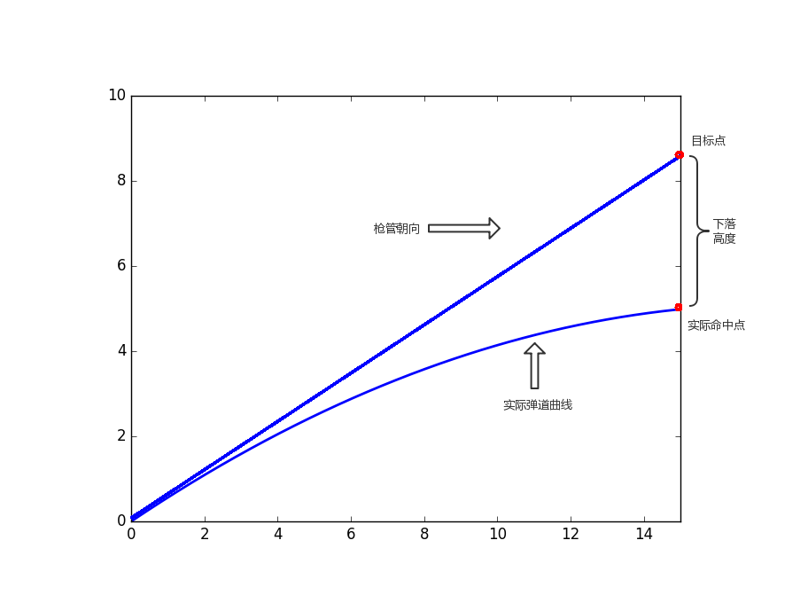

说明：模型适配陈君【[chenjunnn](https://github.com/chenjunnn)】的整车状态最优估计器自瞄的电控部分

如果感觉对你有帮助的话，不要吝啬你的小星星哦

# 弹道解算

给定目标位置坐标(x,y,z)，求解**出射角θ（炮台仰角）**

---

本文基本约定：

* 右手坐标系
* 
* pitch轴 y轴为转轴 从y轴正向看向原点，逆时针方向为pitch轴正方向
* yaw轴 z轴为转轴 从z轴正向看向原点，逆时针方向为pitch轴正方向
* 
* 某弹道竖直方向切面 
  $$
  s = \sqrt{x^2+y^2}
  $$

   ， z为纵轴

---

## 理想弹道模型

只考虑重力作用，弹道为抛物线



$$
横轴为s = \sqrt{x^2+y^2},纵轴为z
$$

---

## 单方向空气阻力模型



当我们直接瞄准目标点（枪管朝向目标点）时，会有一个下落高度。

我们将利用这个**下落高度**进行**迭代补偿**。

考虑到1v1近战，距离较近，枪管倾斜角度不会过大，因此只考虑竖直方向的重力和水平方向的空气阻力

设发射速度为 v0 倾斜角为 θ

竖直方向(z)：

$$
z = v_0tsinθ - \frac{1}{2}gt^2
$$

水平方向(s)：

$$
s = \sqrt{x^2+y^2}
$$

$$
空气阻力模型: f = \frac{CρSv_s^2}{2}
$$

C为球体在空气中的摩擦系数 一般取值0.47

ρ为空气密度，在温度为0摄氏度、标准大气压下取值为1.293kg/m^3,  25摄氏度、标准大气压取值为1.169kg/m^3

S为接触面积

小弹丸参数：

质量 ：3.2g±0.1g
尺寸 ：16.8mm±0.2mm

$$
在标压，25摄氏度下算得小弹丸   k_1=0.038
$$

实际值会偏大

$$
v_s = v_0cosθ
$$

$$
简化得:f_s = k_0v_s^2·····k_0=\frac{CρS}{2}
$$

$$
\frac{-f_s}{m}= a =\frac{dv_s}{dt}
$$

$$
\frac{-k_0v_s2}{m}=\frac{dv_s}{dt}
$$

$$
\frac{-k_0}{m}dt=\frac{dv_s}{v_s^2}
$$

$$
k_1dt=\frac{-dv_s}{v_s^2}······k_1 = \frac{k_0}{m}
$$

$$
积分得 k_1t + C = \frac{1}{v_s}
$$

$$
由 v_s(t=0) = v_{x0} = v_0cosθ 得 C = \frac{1}{v_{x0}}
$$

$$
得 v_s = \frac{v_{x0}}{k_1v_{x0}t+1}
$$

$$
积分得 s = \frac{1}{k_1}ln(k_1v_{x0}t+1)······式(1)
$$

---

## 迭代重力-空气阻力补偿

迭代过程：

* 设置目标点targetPoint(x, y, z)
* 设置临时目标点tempPoint = targetPoint
* 循环迭代n次(10-20次)：

  * 计算仰角(pitch)   angle = 枪管指向tempPoint的角度
  * 利于单方向空气阻力模型，计算实际命中点realPoint
  * 计算误差 deltaZ = targetPoint - realPoint
  * 更新tempPoint = tempPoint + deltaZ
* 得到最终的angle和deltaZ

更新公式

$$
由式(1)得 t = \frac{e^{k_1x}-1}{k_1v_{x0}} = \frac{e^{k_1x}-1}{k_1v_0cosθ}
$$

$$
实际落点z_{actual} = v_0tsinθ - \frac{1}{2}gt^2
$$

目标落点z0

$$
计算误差 dz = z_0 - z_{actual}
$$

$$
抬高枪口 z_{temp} = z_{temp} + dz ······z_{temp}初始值为z_0
$$

$$
迭代，使z_{actual}逐渐逼近真实落点z_0
$$

---

## 完整弹道模型

---

## 文件说明

```bash
│  .gitignore
│  ECterminal.c                     电控端文件
│  readme.md
│  SolveTrajectory.c              调试文件
│  SolveTrajectory.h              头文件
│
├─.vscode
│      settings.json
│      tasks.json
│
├─pic
|       coordinate.jpg
|       projectile.png
|       projectile_model.png
|       rotations.png
```


---

## 参考文献

[1]RoboMaster 2019 AI Robot Platform
[RoboMaster/RoboRTS-Tutorial: RoboRTS Tutorial (github.com)](https://github.com/RoboMaster/RoboRTS-Tutorial)

[2][RoboMaster OSS](https://robomaster-oss.github.io/rmoss_tutorials/#/rmoss_core/rmoss_projectile_motion/projectile_motion_iteration)

[3][chenjunnn/rm_auto_aim: RoboMaster 装甲板自动瞄准算法模块 (github.com)](https://github.com/chenjunnn/rm_auto_aim)

[4][chenjunnn/rm_serial_driver: RoboMaster 视觉系统与电控系统的串口通讯模块 (github.com)](https://github.com/chenjunnn/rm_serial_driver)
